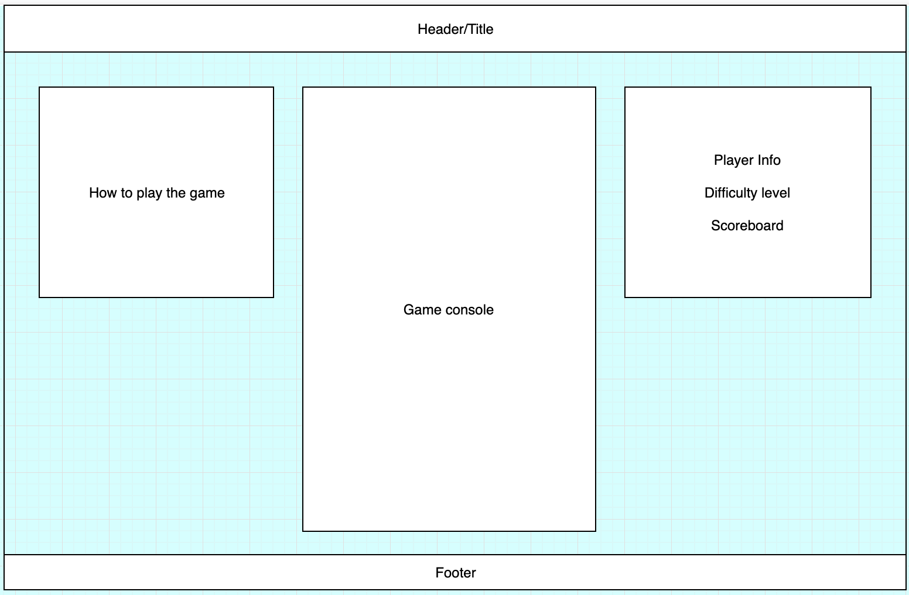

# JavascriptProject

Overview

Tetris is my favorite game and I would enjoy making my own version of it. I expect it to offer a valuable experience with javascript class interactions. The scope of game controls would include having different pieces rotate in either direction with help of arrow keys.

I would like to add some dynamics and colors to blocks to make the experience more interesting.

Functionality

Players will use left/right arrow keys to rotate blocks.
Game will have at least 2 levels of difficulty based on speed.
Blocks will have varying speed based on the level of difficulty they choose.
The game will end once player fails to avoid stacking blocks up to the top.
The score will be displayed on the side panel, updating in real time.
Optional: Background music

Technologies used

Vanilla JavaScript for game logic.
HTML5 Canvas/D3 for rendering.
Webpack as bundler for scripts.

Main files

board.js for rendering the board grid.
block.js for blocks dynamics and manipulation.
player.js for user to access blocks and board via input controls.
scorepanel.js for score display.

MVPs

 [] Basic interface with game directions, console, player info, score.
 
 [] Blocks rotate as per player input.
 
 [] Block stack limit cause Game Over.
 
 [] Window styling and scoreboard.

Development timeline

Day 1:
 Briefly review games using canvas from the instructional curriculum.
 Basic project setup.
 Basic board design and rendering.

Day 2:
 Start Blocks component, get shapes and rendering.
 Try and finish blocks rendering and rotation functionality.

Day 3:
 Implement block stacking.
 Implement gameover on exceeding stack limit.
 Implement real-time score update.

Weekend:
 Finish styling page.
 Complete MVPs.
